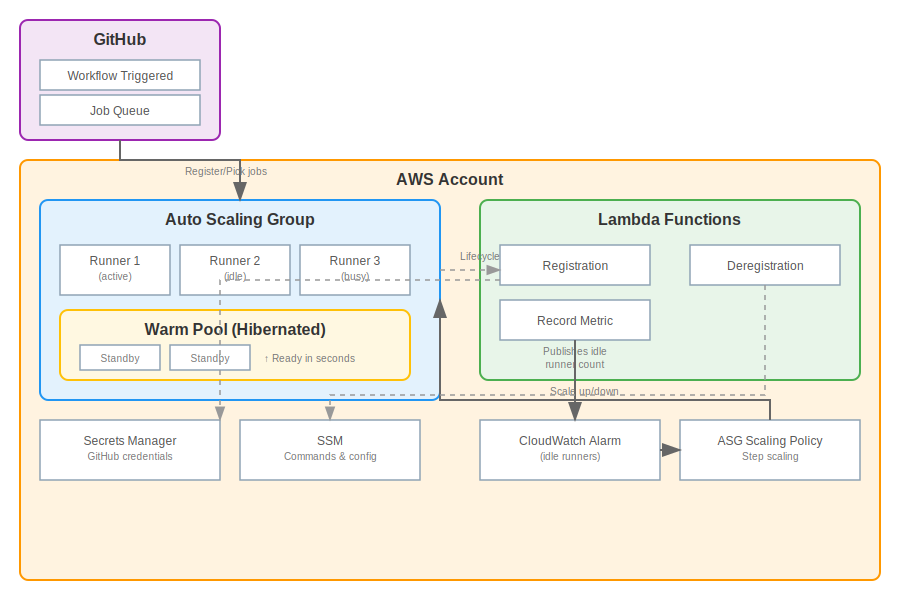

# Architecture

This document explains how the InfraHouse GitHub Actions Runner module works.

## Overview



## Components

### Auto Scaling Group

The core of the module is an AWS Auto Scaling Group that manages EC2 instances:

- **Launch Template**: Defines instance configuration (AMI, instance type, security groups)
- **Scaling Policies**: Step scaling based on CloudWatch alarms
- **Lifecycle Hooks**: Ensure proper registration/deregistration with GitHub
- **Warm Pool**: Keeps hibernated instances ready for fast scaling

### Lambda Functions

Three Lambda functions manage the runner lifecycle:

#### 1. Registration Lambda (`runner_registration`)

Triggered by ASG lifecycle hook when an instance launches:

1. Retrieves GitHub credentials from Secrets Manager
2. Generates a runner registration token
3. Stores token in Secrets Manager for the instance to retrieve
4. Completes the lifecycle hook

#### 2. Deregistration Lambda (`runner_deregistration`)

Triggered by ASG lifecycle hook when an instance terminates:

1. Sends SSM command to gracefully stop the runner service
2. Deregisters the runner from GitHub
3. Cleans up the registration token from Secrets Manager
4. Completes the lifecycle hook

Also runs on a schedule to clean up orphaned runners.

#### 3. Record Metric Lambda (`record_metric`)

Runs on a schedule (default: every minute):

1. Queries GitHub API for current runner status
2. Counts idle runners
3. Publishes metric to CloudWatch
4. CloudWatch alarms trigger scaling based on this metric

### CloudWatch Alarms

Two alarms control scaling:

- **idle_runners_low**: Triggers scale-out when idle runners < target
- **idle_runners_high**: Triggers scale-in when idle runners > target

### Warm Pool

The warm pool keeps instances in a hibernated state:

- Instances are fully booted and configured
- When needed, they wake up in seconds (vs. minutes for cold start)
- Disabled automatically when using spot instances (AWS limitation)

## Instance Lifecycle

### Launch Sequence

```
1. ASG decides to launch instance
         │
         ▼
2. Instance starts from launch template
         │
         ▼
3. registration lifecycle hook fires
         │
         ▼
4. Registration Lambda:
   - Gets GitHub token/App credentials
   - Creates runner registration token
   - Stores token in Secrets Manager
   - Completes hook
         │
         ▼
5. Instance cloud-init runs:
   - Installs packages
   - Runs Puppet (if configured)
   - Retrieves registration token
   - Registers runner with GitHub
   - Starts runner service
         │
         ▼
6. bootstrap lifecycle hook fires
         │
         ▼
7. Instance calls ih-aws to complete hook
         │
         ▼
8. Instance enters InService state
         │
         ▼
9. Runner picks up jobs from GitHub
```

### Termination Sequence

```
1. ASG decides to terminate instance
   (scale-in, max lifetime, health check)
         │
         ▼
2. deregistration lifecycle hook fires
         │
         ▼
3. Deregistration Lambda:
   - Sends SSM command: stop runner service
   - Waits for running job to complete
   - Deregisters runner from GitHub
   - Deletes registration token
   - Completes hook
         │
         ▼
4. Instance terminates
```

## Scaling Behavior

### Scale Out (Add Runners)

1. `record_metric` Lambda publishes idle runner count
2. `idle_runners_low` alarm enters ALARM state
3. ASG scaling policy adds instances
4. If warm pool has instances: wake from hibernation (fast)
5. If warm pool empty: launch new instance (slower)

### Scale In (Remove Runners)

1. `record_metric` Lambda publishes idle runner count  
2. `idle_runners_high` alarm enters ALARM state
3. ASG scaling policy removes instances
4. Lifecycle hook ensures graceful deregistration
5. Instance returns to warm pool (if enabled) or terminates

## Security Model

### Instance Permissions

Runners have minimal IAM permissions:

- SSM for command execution
- Secrets Manager read for registration token only
- CloudWatch for metrics

### Lambda Permissions

Each Lambda has scoped permissions:

- Registration: Secrets Manager write, GitHub API
- Deregistration: SSM commands, Secrets Manager delete, GitHub API
- Record Metric: GitHub API read, CloudWatch put metric

### Network

- Runners in private subnets with NAT gateway
- Lambdas in VPC with access to AWS services
- Security group allows only outbound traffic
