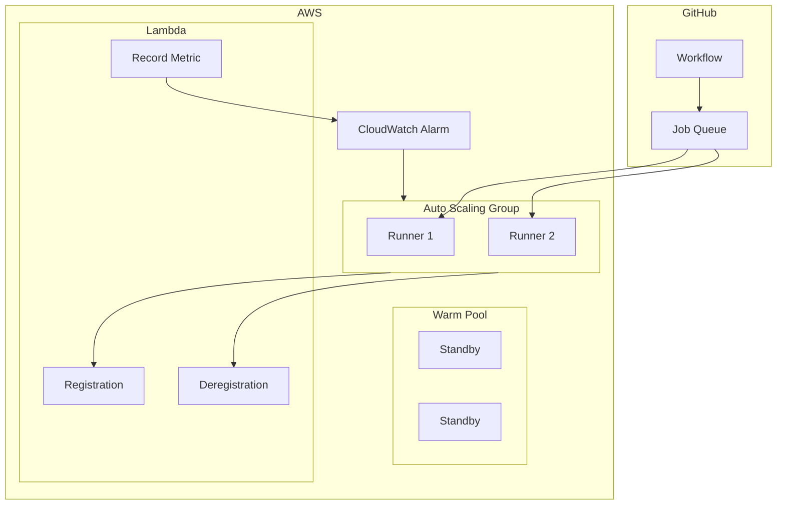

# Assets

Place your images here:

- `logo.png` - InfraHouse logo (recommended: 128x128 or larger)
- `favicon.ico` - Browser favicon
- `architecture.png` - Architecture diagram

## Creating the Architecture Diagram

You can create the architecture diagram using:

1. **draw.io** - Free, exports to PNG
2. **Excalidraw** - Hand-drawn style
3. **Mermaid** - Code-based diagrams (supported in docs)

Example Mermaid diagram (can be embedded in docs):

## Generating Logo

If you don't have a logo, you can use text or generate one.

For now, the theme will work without these files (with default Material icons).
