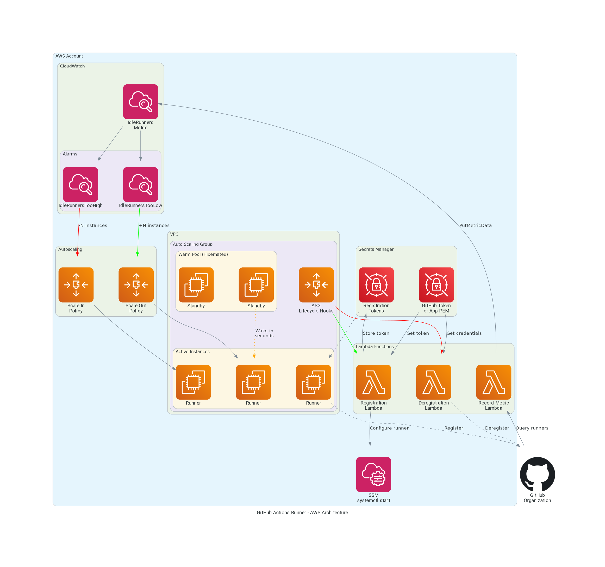

# InfraHouse GitHub Actions Runner

This Terraform module creates an Auto Scaling Group (ASG) and registers its instances
as self-hosted runners for GitHub Actions.



## Why This Module?

There are several community modules for GitHub Actions runners on AWS. Here's why InfraHouse built its own:

### Design Philosophy

| Aspect | InfraHouse Module | Community Modules |
|--------|-------------------|-------------------|
| **Scaling** | ASG-native with CloudWatch metrics | Lambda-driven, bypasses ASG |
| **Warm Pool** | Native ASG warm pool (hibernated instances) | Not supported |
| **Configuration** | Puppet-based | Shell scripts |
| **Complexity** | ASG + CloudWatch + 3 Lambdas | API Gateway + Webhooks + SQS + EventBridge + 6+ Lambdas |
| **Compliance** | Built-in Lambda monitoring (ISO 27001) | Basic logging only |

### Key Advantages

- **Fast instance availability**: Warm pool keeps hibernated instances ready — they wake up in seconds
- **Puppet integration**: Works with your existing Puppet infrastructure
- **Simpler operations**: Fewer moving parts means easier debugging at 2am
- **Compliance-ready**: All Lambdas use `terraform-aws-lambda-monitored` with error alerting, throttle monitoring, and configurable log retention

## Features

- **Auto Scaling Group** with warm pool support for fast instance availability
- **Spot Instances** with configurable on-demand base capacity
- **GitHub App or Token** authentication
- **Puppet integration** for instance configuration
- **CloudWatch-based autoscaling** on idle runner count
- **Lambda monitoring** with SNS alerting (ISO 27001 compliant)
- **Lifecycle hooks** for graceful registration and deregistration

## Quick Start

```hcl
module "actions-runner" {
  source  = "registry.infrahouse.com/infrahouse/actions-runner/aws"
  version = "~> 3.2"

  # Required
  environment              = "production"
  github_org_name          = "your-org"
  subnet_ids               = ["subnet-abc123", "subnet-def456"]
  alarm_emails             = ["oncall@example.com"]

  # Authentication (choose one)
  github_token_secret_arn  = aws_secretsmanager_secret.github_token.arn
  # OR
  # github_app_pem_secret_arn = aws_secretsmanager_secret.github_app.arn
  # github_app_id             = 123456

  # Optional customization
  instance_type            = "t3a.large"
  asg_min_size             = 1
  asg_max_size             = 5
  extra_labels             = ["docker", "terraform"]
}
```

## Documentation

- [Getting Started](getting-started.md) — Prerequisites and first deployment
- [Architecture](architecture.md) — How the module works
- [Configuration](configuration.md) — All available options
- [Authentication](authentication.md) — GitHub App vs Token setup
- [Scaling](scaling.md) — Warm pool, autoscaling, and spot instances
- [Monitoring](monitoring.md) — Lambda alerting and compliance
- [Troubleshooting](troubleshooting.md) — Common issues and solutions
- [Comparison](comparison.md) — How this module compares to alternatives
